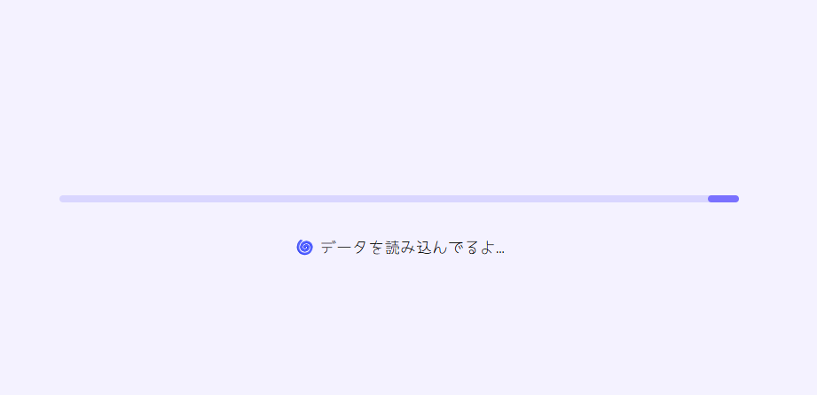
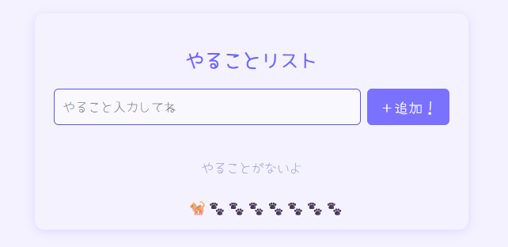
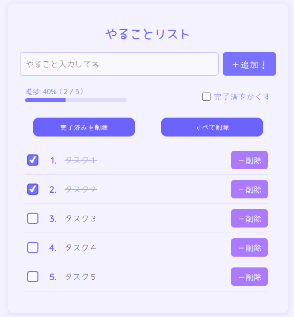
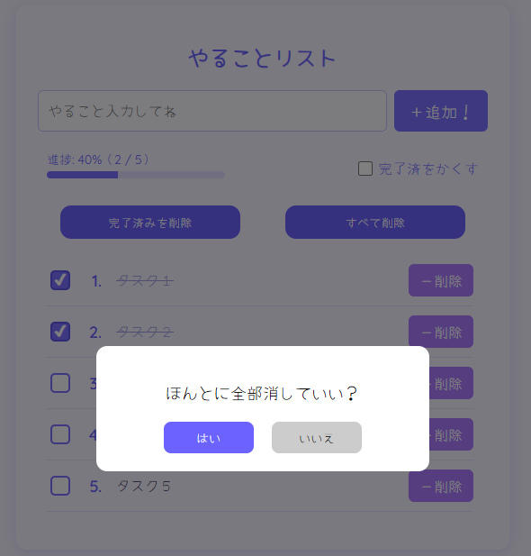

### `README.md`

## 📚 目次

- [🖼️ 画面キャプチャ](#️-画面キャプチャ)
  - [🌀 起動時：読み込み中の画面](#-起動時読み込み中の画面)
  - [📭 タスクがひとつもないときの画面](#-タスクがひとつもないときの画面)
  - [📋 タスク一覧・追加・進捗確認ができるメイン画面](#-タスク一覧追加進捗確認ができるメイン画面)
  - [⚠️ 「すべて削除」ボタンを押した際の確認モーダル](#-すべて削除ボタンを押した際の確認モーダル)
- [🚀 主な機能](#-主な機能)
- [🧠 技術スタック](#-技術スタック)
- [🔧 開発環境と起動方法](#-開発環境と起動方法)
- [🗓️ 製作期間](#-製作期間)
- [📁 関連資料 (docs/)](#-関連資料-docs)


# 📝 React × TypeScript 製 Todo アプリ

Next.js × TypeScript で約 4 日間かけて作成した、ローカル完結型の Todo 管理アプリです。
状態管理には Context + useReducer を使用し、型安全かつコンポーネント志向の開発を意識しました。

---

## 🖼️ 画面キャプチャ

### 🌀 起動時：読み込み中の画面

<div align="center">
  
</div>

---

### 📭 タスクがひとつもないときの画面

<div align="center">
  
</div>

---

### 📋 タスク一覧・追加・進捗確認ができるメイン画面

<div align="center">
  
</div>

---

### ⚠️ 「すべて削除」ボタンを押した際の確認モーダル

<div align="center">
  
</div>

---

## 🚀 主な機能

- Todo の追加・編集・削除・完了切替〈キーボード操作対応〉
- ローカルストレージ保存・初回読み込み時のローディング表示〈2 秒ダミー遅延〉
- 進捗バー、完了 Todo の非表示切り替え、空リスト時の専用 UI
- 削除操作時の確認モーダル
- スクロール制御〈追加時は最下部へ、削除時は最上部へ〉

---

## 🧠 技術スタック

- **フレームワーク**: React (Next.js)
- **言語**: TypeScript
- **状態管理**: React Context + useReducer
- **スタイル**: CSS Modules
- **データ保持**: LocalStorage

---

## 🔧 開発環境と起動方法

```bash
# パッケージをインストール
npm install

# 開発サーバーを起動
npm run dev
```

アプリは `http://localhost:3000` で確認できます。

---

## 🗓️ 製作期間

2025 年 5 月 27 日 ～ 30 日　(約 4 日間で開発)

---

## 📁 関連資料 (docs/)

- [`docs/overview.md`](./docs/overview.md) ：開発背景・目的・アピールポイント
- [`docs/implementation.md`](./docs/implementation.md) ：機能詳細・構成・データ流れ
